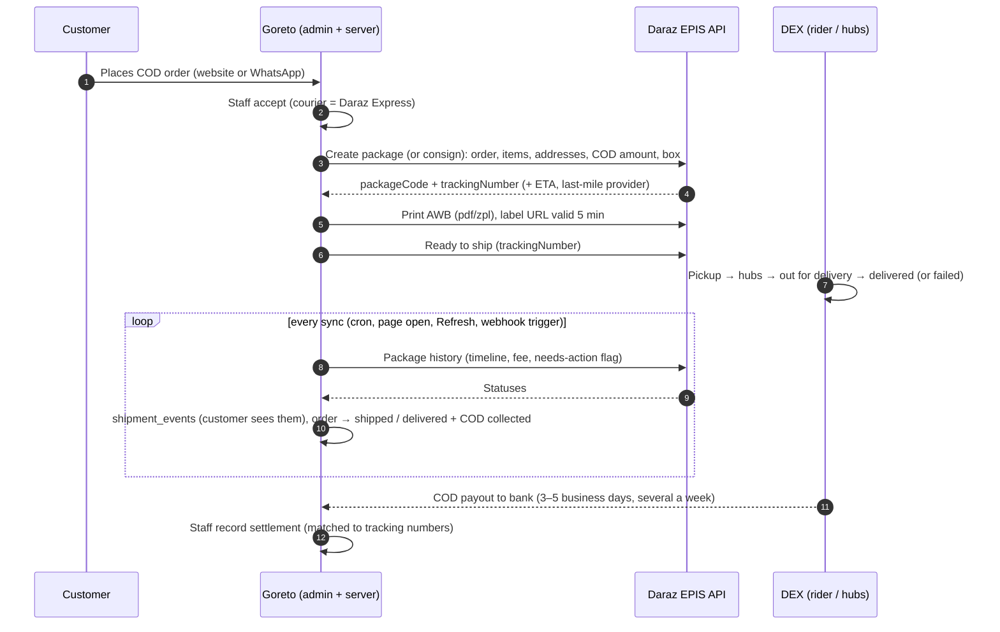

# Daraz Express (DEX): technical reference

How Goreto books, tracks and settles parcels with Daraz Express through the Daraz Open Platform **Logistics API (EPIS, "External Partner Integration System")**.

- Client handout: [daraz-meeting-brief.md](daraz-meeting-brief.md)
- Workflow diagram: [daraz-workflow.svg](daraz-workflow.svg)
- Requests, questions, testing without keys, troubleshooting: [daraz-qa.md](daraz-qa.md)
- Approved plan: [`prompts/goreto-daraz-courier.md`](../../prompts/goreto-daraz-courier.md)

_Researched 2026-10-06 from:_

- Daraz Open Platform doc service (`open.daraz.com/handler/share/apidoc/*`, `…/doc/*`);
- Lazada Open Platform (the same "IOP" platform, with fuller docs);
- DEX's merchant pages (`www.dex.com.pk/support`, which links its API to these same EPIS docs);
- a probe of `oms.dex.com.np`;
- DEX Nepal launch coverage (ShareSansar and The Himalayan Times, 2025-11-02).

Items marked **(confirm)** are open questions for Daraz.

---

## 1. The pieces

| Piece | What | Owner |
| --- | --- | --- |
| **DEX OMS** `oms.dex.com.np` | Merchant portal: account, shipments, COD payouts, bills, OTP "bundle code" for linking a platform | Client |
| **Daraz Open Platform** `open.daraz.com` | Developer account, app, App Key/Secret, API permissions, push (webhook) settings, API statistics. Sign-up: `iopaccount.daraz.com/register` | Client account, operated by us |
| **EPIS gateway** `https://api.daraz.com.np/rest` | The API Goreto calls | Daraz |
| **Goreto** | Order acceptance, booking, labels, tracking sync, failed-delivery handling, COD reconciliation, support cases | Us |

The scope decision of 2026-10-06 is **DEX courier only**. Listing Goreto products on the Daraz marketplace (seller OAuth, Product/Order/Finance APIs, a 2-week API test quota) would be a separate phase (§12).

## 2. End-to-end flow

Failure paths:

- **Delivery fails.** History sets `notifyVasFdStorage = true`. Goreto notifies staff, who send **Re-attempt** (date and note) or **Return** (`/packages/reattempt`).
- **Cancel before pickup.** `/packages/cancel`. Rebooking uses a new reference (§6.3).
- **Changed receiver details after ready to ship.** `/packages/update`.
- **Lost, damaged or disputed parcel.** A support case through XSpace (`/logistics/epis/xspace/*`).

## 3. Authentication and signing

EPIS endpoints are **`authType 0`**: they need the app's key and secret only, no seller `access_token`. The store's DEX account is linked to our platform once, with the OTP bundle code from OMS.

**System parameters on every call:**

- `app_key`;
- `timestamp` (ms; must be within 7,200 s of UTC);
- `sign_method=sha256`;
- `sign`.

**Signature:**

1. Sort all parameters except `sign` by name (ASCII).
2. Concatenate `name + value` with no separators.
3. Prefix the API path.
4. HMAC-SHA256 with the App Secret.
5. Convert to **uppercase hex**.

Daraz's worked example: `/order/get`, secret `helloworld` → `4190D323…FAB4A`. Our unit test reproduces it (`src/lib/courier/daraz/sign.test.ts`).

**Encoding:**

- System parameters go in the query string. Business parameters go in the `application/x-www-form-urlencoded` body for POST, or the query for GET.
- Object and array parameters are sent as **JSON strings**, as the official SDKs do.
- The signature covers the exact strings sent.

**Responses:**

- Gateway errors: `{type, code ≠ "0", message, request_id}`.
  - Signature errors: `IncompleteSignature`, `MissingParameter`, `InvalidSignature`.
- EPIS business results: `{code: "0", success, retryable, traceId, errorCode, errorMessage, errors[{field: "$.path", errorMessage}], data}`.
- Booleans and numbers often arrive **as strings** (`"true"`, `"1701104399000"`).

## 4. Endpoints

Gateway: `https://api.daraz.com.np/rest` + path. Goreto's wrappers are in `src/lib/courier/daraz/epis.ts`.

| Endpoint | Method | Used for | Key inputs | Key outputs |
| --- | --- | --- | --- | --- |
| `/logistics/epis/customers/external_relationships_bundle` | GET/POST | Link the store's DEX account to our platform (once) | `externalSellerId`, `platformName`, `otp` (bundle code from OMS) | success |
| `/logistics/epis/customers/warehouses` | POST | Create or update the pickup (`NORMAL`) and return (`RETURN`) warehouses | `externalSellerId`, `platformName`, `warehouseCode`, `warehouseName`, `contactName`, `phone`, `email`, `type`, `address{id (R-code, required), details}`, `solutionCodes[]` (required, from Daraz), optional `configuration{deliveryNote, services[{serviceName e.g. vas_fd_storage, enable, properties}]}` | `convertedAddress{id, details}` |
| `/logistics/epis/service/delivery_options` | GET | Options before booking (hidden from the doc list; spec dated 2026-06-10) | `shipper`, `origin{id,details}`, `destination{id,details}`, `fromLocation`/`toLocation` (lat/lng), `dimWeight`, `payment`, `deliveryOption` | `[{deliveryOption, firstMileDeliveryType (Pickup/Drop-off), pickupTargetCutoffTime, first/last-mile provider}]` |
| `/logistics/epis/estimate_shipping_fee` | GET/POST | DEX fee before booking (hidden from the list; spec dated 2026-08-29) | `externalSellerId`, `platformName`, `fromAddressId`, `toAddressId`, `chargeFactor{paymentType, weight (g), deliveryOption, packageType, insuranceAmount}` | `[{transactionType: Delivery/COD/Insurance/Surcharge, amount, taxAmount, currency}]` |
| `/logistics/epis/packages` | POST | **Create package**: DEX's documented "Create an Order" | See §6 | `packageCode`, `trackingNumber`, `minEta`/`maxEta` (ms), first/last-mile provider, `routeCode`, `portCode`, `appliedVas` |
| `/logistics/epis/packages/consign` | POST | Alternative booking: "consign to get the tracking number and print AWB" | Same body as create | Same |
| `/logistics/epis/packages/awb` | GET | Shipping label | `packageCode`, `type` = `pdf` or `zpl` | `url` (**valid 5 minutes**) |
| `/logistics/epis/packages/rts` | POST | Ready to ship | `trackingNumber`, optional `paidEstimatedShippingFee` | Package data |
| `/logistics/epis/packages/update` | POST | Change receiver or COD after RTS | `packageCode`, `receiverName`, `receiverPhone`, optional `totalAmount`, `insuranceAmount`, `deliveryNote`, `receiverAddress{id, details, type}` | success |
| `/logistics/epis/packages/cancel` | POST | Cancel before pickup | `packageCode`, `reason` | success |
| `/logistics/epis/packages/reattempt` | POST | Failed-delivery decision | `packageCode`, `feedbackType` = `REATTEMPT` or `RETURN`, `reAttemptDateTime` (ms), `sellerNote` | success |
| `/logistics/epis/packages/history` | GET | Tracking | `trackingNumber`, `includeTimeline=true`, `includeShippingFee=true`, optional `secret` (last 4 digits of a phone, unmasks personal data) | `status`, `timeline[{status, processTime, reasonCode, location, shippingProvider, epod, photos, driverName, driverContact, vehicleNumber, trackingUrl}]`, `shippingFee`, `chargeableDimWeight`, `notifyVasFdStorage` |
| `/logistics/epis/xspace/create` | POST | Open a support case | `subject`, `description`, optional `trackingNumber`, `orderId`, `caseTemplateId`, `categoryId`, `casePriority`, `attachments`, `platformName`, `externalSellerId` | `caseId` |
| `/logistics/epis/xspace/query` | GET/POST | List cases | `caseIds[]`, `trackingNumbers[]`, time range, paging, `statuses[]` | Cases |
| `/logistics/epis/xspace/detail` | POST | Case detail and replies | `caseId` | Case with `mails`, `actions`, `status` |
| `/logistics/epis/xspace/rate` | GET/POST | Rate a resolved case | `caseId`, `ratingStar`, `ratingReasons[]`, `ratingRemark` | success |

Lazada exposes more EPIS endpoints that **Daraz doesn't document**: `consign/v2`, `cancel/v3`, `get_shipping_fee`, and `external_relationships` without OTP. We don't use them unless Daraz says they're enabled.

## 5. Webhooks (push)

| Rule | Value |
| --- | --- |
| URL | `https://<site>/api/courier/webhooks/daraz` |
| TLS | **OV or EV certificate required. DV is rejected** (Daraz and Lazada push docs) |
| Ack | HTTP 200 **within 500 ms**. Otherwise Daraz retries every 30 min, up to 12 times |
| Signature | `Authorization: hex(HMAC-SHA256(appKey + rawBody, appSecret))`, lowercase |
| Setup | App Console → Message Service → URL → **Verify** (Daraz sends a test message) → subscribe message types → push log |
| Documented messages | Marketplace only: trade order, reverse order, fulfilment update `message_type 14`. **No EPIS (DEX partner) parcel message is documented (confirm)** |

**How Goreto handles it:**

1. Verify the signature and cap the body at 256 KB.
2. Store the raw message in `courier_webhook_inbox`, deduplicated by SHA-256 of the body, then reply 200 immediately.
3. After the reply, find any tracking number or package code in the message, fetch `/packages/history`, and apply it.

The push is only a trigger; the history API is the source of truth. This works whatever shape Daraz uses for DEX pushes.

**Certificate gap.** `goreto-kappa.vercel.app` uses Vercel's `*.vercel.app` certificate from Google Trust Services WR1, policy `2.23.140.1.2.1`, which is **DV**. Vercel allows uploading your own certificate only on **Enterprise**. If Daraz enforces OV/EV, the options are:

- **(a)** run without pushes. Polling is complete on its own (§7);
- **(b)** put a small relay on a host that accepts an uploaded OV certificate (for example AWS API Gateway with a custom domain and an imported OV certificate in ACM) that forwards to our URL unchanged;
- **(c)** move to Vercel Enterprise.

## 6. Booking payload (create/consign)

Built server-side from the order's **immutable snapshot** (`buildConsignment` in `src/lib/courier/daraz/payloads.ts`). The browser never supplies prices.

| Field | Goreto value |
| --- | --- |
| `externalOrderId` | `provider_reference`: the order number, or `<order>-R<n>` when rebooking after a cancel (§6.3) |
| `packageType` | `Sales_order` |
| `platformOrderCreationTime` | Order `created_at` (ms) |
| `dangerousGood` | `false` |
| `deliveryOption` | From the purchased service's `provider_option`, or the default (`standard` or `economy`) |
| `items[]` | `{id: order_item id, name: title - variant, sku, quantity, unitPrice, paidPrice, category}`. `paidPrice` spreads the order discount across lines in whole paisa |
| `shipper` | `{externalSellerId, platformName, externalWarehouseCode: pickup warehouse}` |
| `origin` | Settings: contact, phone, `address{id: origin R-code, details}`, `geoLocation` if set |
| `destination` | Snapshot: recipient, phone, email, `address{id: R-code from daraz_locations if mapped, city: municipality, details: "street, Ward n, municipality, district, province"}`, `geoLocation` if the customer shared it |
| `payment` | `{totalAmount: order total (rupees, 2 dp), currency: "NPR", paymentType: "COD", insuranceAmount?}` |
| `dimWeight` | Staff choose a box preset or enter L/W/H in cm; weight in g is prefilled from the variant weights |
| `options` | `{openBox, deliveryNote (staff note · customer note), partnerOrderId: order number, undeliverableOption: RETURN or SCRAP}` |

### 6.1 Money

Goreto stores integer **paisa**. Daraz receives rupee strings (`249950` → `"2499.50"`). COD `totalAmount` is the order **total**: items minus discount plus our delivery fee, which is what the rider collects.

### 6.2 Phones

The setting `phone_format` is either `national` (`9812345678`, the default) or `e164` (`+9779812345678`) **(confirm)**.

### 6.3 Idempotency and rebooking

Daraz records only the **first** request per `externalOrderId`; repeats are treated as duplicates. So:

- **Double-click or retry:** same reference, same package. Goreto's `admin_record_provider_booking` accepts the same package code again and does nothing.
- **Rebook after cancel:** the reference becomes `<order>-R2`, `-R3`, and so on (`shipments.provider_booking_attempts`).

## 7. Tracking sync

**Triggers:**

- the daily Vercel cron `/api/cron/courier-sync` (Bearer `CRON_SECRET`);
- optionally, Supabase `pg_cron` every 15 min (see `docs/releasing.md`);
- opening an order that's more than 15 minutes stale;
- **Refresh tracking**;
- webhook pushes.

**Each sync** calls `/packages/history` and then the database function `provider_history_core`. That function:

- inserts **new** timeline events only, keyed `STATUS|processTime`, as `source = 'courier_api'`, with hub location text;
- moves the order forward only along legal steps:
  - pickup or any later movement → **shipped**;
  - **delivered** → **delivered** and **COD collected**;
- never cancels anything. Failures and returns notify staff (`courier_attention`) and wait for a decision;
- never stores rider names, phones, photos or ePOD links. Staff can view proof of delivery live from Daraz.

`processTime` may arrive in seconds (Daraz's example is `1600000000`) or milliseconds; values below 1e12 are treated as seconds.

### 7.1 Status mapping

Implemented in `src/lib/courier/daraz/status-map.ts`. Statuses are normalised first: uppercase, `INFO_ST_` and `DOMESTIC_` prefixes removed, so `domestic_delivered` = `INFO_ST_DOMESTIC_DELIVERED` = `DELIVERED`. Unknown statuses are recorded with Daraz's wording but **don't move** the order. The full Nepal list is still to confirm.

| Daraz status (normalised) | Goreto shipment status | Order effect |
| --- | --- | --- |
| `READY_TO_SHIP`, `READY_TO_SHIP_PENDING`, `PACKAGE_READY_TO_BE_SHIPPED`, `TRANSIT_TO_SHIP`, `REQUESTING_DRIVER`, `DRIVER_ASSIGNED`, `PACKAGE_CREATED` | assigned | none |
| `PICKUP_SIGN_IN_SUCCESS`, `PICKUP_SUCCESS`, `PICKED_UP` | picked_up | → shipped |
| `IB_SUCCESS_FIRST_MILE_HUB`, `OB_SUCCESS_FIRST_MILE_HUB`, `SC_SIGN_IN_SUCCESS`, `IB_SUCCESS_IN_SORT_CENTER`, `OB_SUCCESS_IN_SORT_CENTER`, `PACKAGE_STATIONED_IN`, `PACKAGE_STATIONED_OUT`, `LAST_MILE_3PL_SHIPPED_TO_STATION`, `LAST_MILE_CUSTOMER_STATION_INBOUND`, `REDELIVERY` | in_transit | → shipped |
| `OUT_FOR_DELIVERY` | out_for_delivery | → shipped |
| `DELIVERED` | delivered | → delivered, COD collected |
| `PICKUP_SIGN_IN_FAILURE`, `1ST_ATTEMPT_FAILED`, `REATTEMPTS_FAILED`, `DELIVERY_FAILED`, `DELIVER_FAILED`, `LAST_MILE_STATION_CUSTOMER_FAILED_PICKUP`, `ON_HOLD`, `RETURN_AT_TRANSIT_HUB`, `ON_THE_WAY_BACK_TO_SHIPPER`, `PACKAGE_RETURNED_FAILED`, `PACKAGE_RETURN_ATTEMPT_FAILED`, `PACKAGE_RETURN_FAILED_PICKUP_PENDING`, `LOST_BY_3PL`, `DAMAGE_BY_3PL`, `PACKAGE_SCRAPPED`, `PACKAGE_INTERCEPTED` | exception | staff notified |
| `BACK_TO_SHIPPER`, `WAREHOUSE_RETURNED` | returned | staff notified; staff cancel the order, which restocks |
| `CANCELLED` / `CANCELED` | (unchanged) | none |
| Anything else | (unchanged) | recorded only |

## 8. Payments (COD)

- **Collected.** The order's `payment_status` becomes `collected` when DEX reports delivery: the customer has paid the rider. This is the same meaning as the staff **Mark delivered** button.
- **With Daraz.** Delivered Daraz parcels that aren't in a recorded settlement. The total is shown on the dashboard.
- **Settled.** Staff record each DEX payout (Admin › Daraz Express › COD settlements): reference, date, gross COD, deductions, and the tracking numbers it covered. Goreto checks every tracking number (it must be delivered and not already settled) and shows **expected vs paid**.
- **No settlement API exists.** Statements come from OMS. DEX pays out **3–5 business days after delivery**, several times a week. Fees appear on a **monthly bill** or as deductions **(confirm)**.
- **DEX fees.** `estimate_shipping_fee` at booking (estimate) and `history.shippingFee` after delivery (actual) are stored on the shipment and visible to staff only. Customers pay Goreto's own delivery rates (Admin › Delivery).

## 9. Goreto data model

**Migration `20261007090000_daraz_courier`:**

- `couriers.api_provider` (`'daraz'` ⇔ `integration_mode = 'api'`);
- `courier_provider_accounts` (non-secret settings, one row per provider);
- shipment provider columns;
- `shipment_events.provider_event_key`;
- `courier_api_log` (no payloads, no personal data);
- `courier_webhook_inbox` (service role only);
- `daraz_locations` (municipality → R-code);
- notification kind `courier_attention`;
- booking/RTS/cancel/history RPCs;
- guards: a live booking pins the courier, and the order can't be canceled before the booking is.

**Migration `20261007100000_daraz_courier_ops`:**

- tracking-number guard;
- rebooking reference and attempt count;
- delivery-options and fee fields;
- receiver update;
- AWB-printed time;
- `courier_services.provider_option`;
- `couriers.tracking_url_template`;
- more settings (booking endpoint, phone format, insurance, item category, origin point, box presets, auto-book, XSpace IDs);
- `courier_remittances` and settlement RPCs, with courier fees and payout links in the staff-only `shipment_courier_finance` (customers can read their own shipment rows, so courier money isn't kept there);
- `courier_support_cases`;
- the dashboard overview (`admin_courier_overview`);
- the WhatsApp handoff is marked as sent through `daraz_api` on booking.

**Migration `20261007110000_daraz_tracking_autobook`:**

- `get_order_tracking` returns `courier_tracking_url` (the courier's template with the tracking number);
- booking split into a private core with a staff caller (`admin_*`) and a service-role caller (`courier_*`) for automatic booking;
- auto-book candidates and failure flag: each order is tried automatically once, and a failure notifies order staff.

**Secrets (env only, never the database):**

- `DARAZ_APP_KEY`;
- `DARAZ_APP_SECRET`;
- `DARAZ_API_URL` (default `https://api.daraz.com.np/rest`; `http://localhost` is allowed in development for the mock server);
- `CRON_SECRET`.

**Service role:** only `src/lib/courier/provider-sync.ts` (webhook and cron) uses it, enforced by `boundaries.test.ts`. Staff actions run with the staff member's own session and permission-checked RPCs.

## 10. Admin screens

**Order page › Daraz Express panel.** Book (box, weight, option, open box, note, live fee estimate), Print label (PDF/ZPL), Ready to ship, Refresh, Edit delivery details, Cancel booking, Re-attempt / Return, View proof of delivery, Open support case.

**Admin › Daraz Express:**

- **Overview**: KPIs and connection health;
- **Shipments**: filters, bulk book, merged label PDF, bulk ready-to-ship, refresh;
- **Needs action**;
- **COD settlements**;
- **Support cases**;
- **Activity**: API log with Daraz trace IDs, webhook inbox;
- **Setup**: test connection, OTP link, warehouses, booking defaults, box presets, auto-book, XSpace IDs, webhook URL, location coverage.

**Delivery & Courier.** A courier switch "Booked through Daraz Express API", a tracking URL template, and a Daraz option per service.

**Customers** see Daraz events and the ETA on `/track`, the confirmation page and their account, plus a "Track on Daraz Express" link when a template is set.

## 11. Operations runbook

| Situation | What to do |
| --- | --- |
| "Daraz rejected the app key or secret" | Check `DARAZ_APP_KEY`/`DARAZ_APP_SECRET` in Vercel (Production) and redeploy. Run **Test connection** |
| Booking fails with field errors | The panel shows Daraz's `$.field: message`. Fix the address, phone, box or settings and book again. The Activity tab has the `traceId` for Daraz support |
| Label link expired | Click **Print label** again. Each print fetches a fresh 5-minute URL |
| Wrong address before pickup | **Cancel booking** with a reason, fix it, then book again (new reference `-R2`) |
| Wrong address after ready to ship | **Edit delivery details** (`packages/update`) |
| Delivery failed | The bell and **Needs action** show it: choose **Re-attempt** (date and note) or **Return** |
| Parcel back at the store | Status *Returned*. Inspect it, then **Cancel order** to restock |
| Lost or damaged | **Open support case** (XSpace) with the tracking number; follow it on the **Support** tab |
| Tracking stuck | **Refresh tracking**. Check Activity for API errors |
| Payout received | **COD settlements → Record settlement**: paste the tracking numbers from the OMS statement and compare expected vs paid |
| Contact | DEX Nepal support contacts **(confirm)**; API support `support-api@daraz.pk` (from Daraz's docs) |

## 12. Risks and open items

1. **Webhook certificate** (OV/EV). We may run without pushes; see §5.
2. **IP whitelist**. If Daraz requires fixed IPs: Vercel Static IPs (about $100 a month per project on Pro) or an egress proxy.
3. **App approval quota**. Daraz's guide requires third-party apps to make "more than 1,000 calls a day at ≥95% success for two weeks" before going online. Ask whether DEX partner apps are exempt.
4. **Status list, reason codes, phone format, solution codes and R-codes** are provisional until Daraz confirms them. They're settings or tables, not code.
5. **Vercel Hobby** allows a daily cron only. Use Supabase `pg_cron` for frequent sync.
6. **Daraz marketplace (future phase, not started).** Needs a seller account on daraz.com.np, OAuth seller authorisation (`/auth/token/create`, refresh), Product APIs (create/update/price-quantity), Order APIs (orders, items, documents), Fulfilment APIs (pack, RTS, AWB), Finance APIs (transactions, payouts) and webhooks (trade order messages), plus Daraz's go-live quota.

## 13. Go-live checklist

- [ ] Client's DEX OMS account is active, with bank details for COD payouts.
- [ ] Open Platform app created; Logistics API permission granted; App Key and Secret set in Vercel **Production only**. Preview and `.env.local` use the mock gateway, so test bookings are never real parcels.
- [ ] Production migrations applied (`20261007090000`, `20261007100000`, `20261007110000`); steps in `docs/releasing.md` § Daraz Express.
- [ ] `CRON_SECRET` set; Vercel cron visible; optional `pg_cron` job created.
- [ ] Admin › Daraz Express › Setup: test connection OK; platform name and seller ID saved; OTP linked; pickup and return warehouses saved.
- [ ] Courier "Daraz Express" marked as API; services mapped (`standard`/`economy`); delivery zones and rates set; tracking URL template set.
- [ ] One real test parcel: book → label → cancel. One delivered parcel tracked end to end.
- [ ] Webhook URL verified in the App Console (if pushes exist for DEX).
- [ ] Nepal status list and R-code list loaded (`scripts/daraz/import-locations.ts`).
